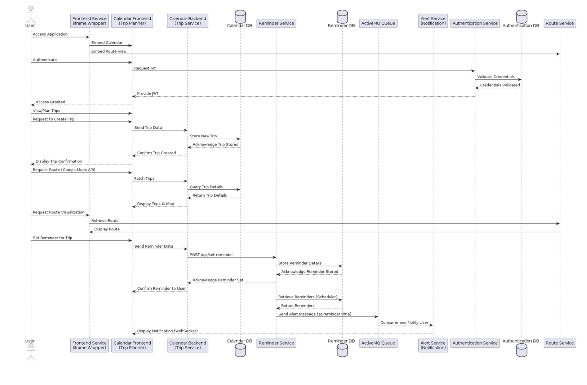

# Service-Oriented Trip Planner

This repository is the central hub for the **Service-Oriented Trip Planner**, a comprehensive application developed for the Service-Oriented Architecture course at the University of Twente. The project is designed using a microservices architecture, with each component of the system operating as an independent, loosely-coupled service.

This central repository provides an overview of the entire system and links to the individual repositories for each microservice.

---

## Abstract

The Service-Oriented Trip Planner is a complete trip planning and reminder system that seamlessly integrates a user-friendly calendar interface with real-time notifications and robust authentication services. By employing a Service-Oriented Architecture with RESTful APIs and asynchronous message queuing, the application offers efficient trip scheduling, timely reminders, and secure user management, demonstrating the power and flexibility of a distributed system.

---

## System Architecture

The application is built on the principles of **Service-Oriented Architecture (SOA)**. The entire system is decomposed into a collection of distinct, autonomous services that communicate with each other over a network.

-   **Synchronous Communication:** Services communicate synchronously using **RESTful APIs**. For example, the frontend service makes direct API calls to the Calendar or Route services to request or post data.
-   **Asynchronous Communication:** For tasks that do not require an immediate response, such as sending reminders, the system uses a **message broker (ActiveMQ)**. This decouples the services, improving fault tolerance and scalability. For instance, the Reminder Service places a message on a queue, and the Reminder Receiver Service consumes it to trigger an alert at the appropriate time.

The entire environment is containerized using **Docker**, and **Docker Compose** is used to orchestrate the deployment and networking of all the services.

---

## Project Repositories (Microservices)

The application is composed of the following microservices, each with its own dedicated repository:

### 1. Frontend Service
The user interface of the application, built with React. It provides the user with an interactive calendar and trip planning interface.
-   **Repository:** [**SOFrontendReact**](https://github.com/LeTartap/SOAFrontendReact)

### 2. Authentication Service
Handles user registration, login, and session management using JWT (JSON Web Tokens) for secure communication between services.
-   **Repository:** [**SOAAuthenticationService**](https://github.com/LeTartap/SOAAuthenticationService)

### 3. Calendar Service
The core of the trip planning functionality. This service manages the creation, updating, and deletion of trips and events in the user's calendar.
-   **Repository:** [**SOACalendarService**](https://github.com/LeTartap/SOACalendarService)

### 4. Route Service
Provides routing and distance calculation functionalities. When a user plans a trip, this service is called to determine the optimal route and travel duration.
-   **Repository:** [**SOARouteService**](https://github.com/LeTartap/SOARouteService)

### 5. Reminder Service
Allows users to set reminders for their upcoming trips. This service is responsible for scheduling the reminders.
-   **Repository:** [**SOAReminderService**](https://github.com/LeTartap/SOAReminderService)

### 6. Reminder Receiver Service
An asynchronous service that listens for messages on the ActiveMQ queue. When a reminder is due, it receives the message from the Reminder Service and triggers a real-time alert to the user.
-   **Repository:** [**SOARemReceiverService**](https://github.com/LeTartap/SOARemReceiverService)

---

## Core Technologies

-   **Frontend:** React.js
-   **Backend:** Node.js with Express.js (for REST APIs)
-   **Database:** MongoDB
-   **Message Broker:** Apache ActiveMQ
-   **Containerization:** Docker & Docker Compose

---

## Authors

* David Galati
* Filip Skulimowski
